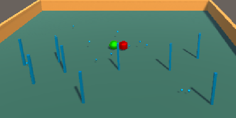
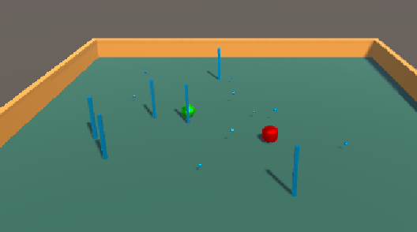
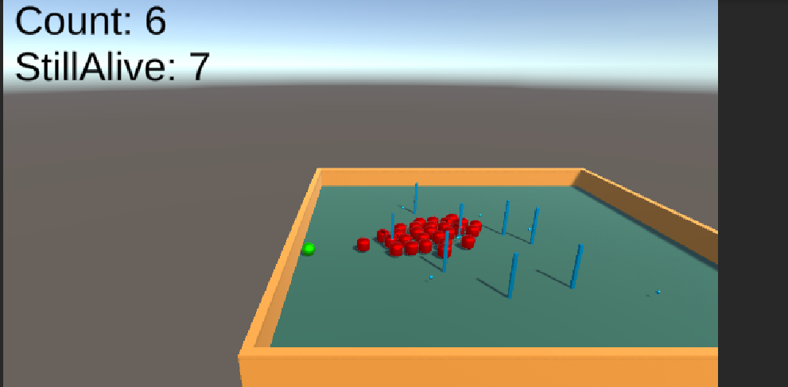
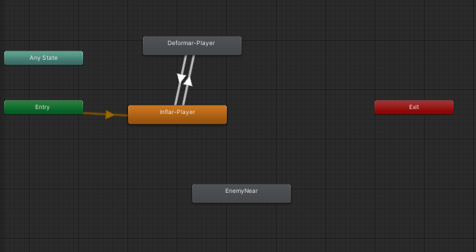
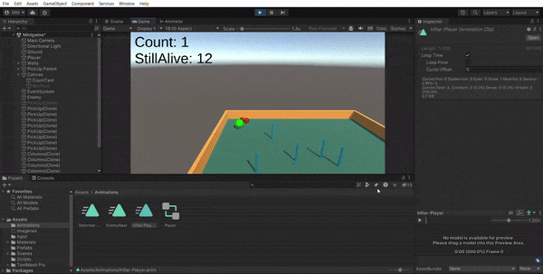

# Roll a Ball en Unity

"Roll a Ball" es un proyecto introductorio en Unity que enseña a los desarrolladores principiantes cómo crear un juego simple. En este proyecto, los jugadores controlan una esfera que rueda sobre una superficie recolectando objetos. Y además hay un tutorial paso a para para hacer el Roll a Ball básico, que en cuestión es [Roll a ball](https://learn.unity.com/project/roll-a-ball). En mi proyecto tiene varias modificación que iré explicando a medida que vo haciendo junto al Readme, cada apartado será un script explicando que hace ese script.

## Como es para el usuario mi Roll a Ball

Sales al iniciar del medio del tablero, donde salen columnas y las monedas que son los cuadraditos pequeños. Te sale un texto arriba a la izquierda que arriba te ponen las que llevas y abajo las que todavia siguen vivas o sin recojer. La bola que es el juegador que controlas con las flechas del teclado, la propia bola va siendo más gorda y se hace delgada para no pasar por las columnas siempre y se dificulte el juego. El juego cuando si el enemigo te da o chocas contra una columna vas más lento y cuando pillas una moneda ganas velocidad. El juego acaba cuando recojes todas las monedas y al saltar puedes sobrepasar al enemigo y te puedes caer si te caes te pone en el centro del tablero lo puedes aprobechar a tu favor.

## PlayerController
Este código gestiona el movimiento y las interacciones de un objeto esférico en un juego desarrollado en Unity, incluyendo la generación de pickups y columnas aleatorias, la actualización de un contador y la detección de colisiones.

### Variables

Aqui presento todas las variables que uso con el jugador.

```C#
private Rigidbody rb;
    private float movementX;
    private float movementY;
	
    private int count;
    public float speed = 0;
	public TextMeshProUGUI countText;
	public GameObject winTextObject;
	public GameObject pickupPrefab;
	public GameObject ColumnsPrefab;

	public int minPickups = 5; 
    public int maxPickups = 10; 
	private float jumpForce = 5.0f;
    private bool isJumping = false;
	// variable para el animator, para poder cambiar y obtener sus valores
	Animator anim;

```
### Función onJump

Funcion que buscara el input system cuando se le de a la barra espaciadora

```C#
void OnJump()
    {
		rb.AddForce(new Vector3(0, jumpForce, 0), ForceMode.Impulse);
		Debug.Log("Dije Salta!");
		isJumping = true;
		anim.SetBool("isJumping", true);
    }
```

### Función Start

La función Start() en el controlador del jugador configura la escena al inicio del juego, asignando componentes y variables necesarias. Luego, llama a métodos para generar objetos aleatorios y actualizar la interfaz de usuario. Finalmente, desactiva un objeto de texto de victoria hasta que se cumplan ciertas condiciones para ganar.

```C#
void Start()
    rb = GetComponent<Rigidbody>();
    Debug.Log("Hola, debugueando");
    anim = GetComponent<Animator>();
    count = 0;
    SpawnPickupsRandomly();
    SpawnColumnsRandomly();
    SetCountText();
    winTextObject.SetActive(false);
}
```

### Función CountPickupsLeft

Cuenta la cantidad de objetos con el tag "PickUp" que quedan en la escena

```C#

int CountPickupsLeft(string tag = "PickUp")
{
    GameObject[] pickups = GameObject.FindGameObjectsWithTag(tag);
    int pickupCount = pickups.Length;
    return pickupCount;
}
```

### Función FixedUpdate

El método `FixedUpdate()` controla la física del juego. Primero, calcula un vector de movimiento basado en las entradas de movimiento en X e Y. Luego, aplica una fuerza al Rigidbody en la dirección del movimiento multiplicada por la velocidad. Si la bola cae por debajo del plano, se reinicia su posición y velocidad. Además, si la bola está cerca del suelo, se asegura de que no esté en un estado de salto, cambiando las variables correspondientes.

```C#
private void FixedUpdate()
{
    Vector3 movement = new Vector3(movementX, 0.0f, movementY);
    rb.AddForce(movement * speed);
    if (transform.position.y < -10)
    {
        transform.position = new Vector3(0, 0.5f, 0);
        rb.velocity = Vector3.zero;
    }
    if (transform.position.y < 0.5f)
    {
        isJumping = false;

        anim.SetBool("isJumping", false);
    }
}
```

### Función onMove

La función `OnMove()` se activa cuando hay movimiento en el input del jugador. Obtiene el vector de movimiento del input y lo muestra en la consola para depuración. Luego, asigna los valores de movimiento en X e Y a variables correspondientes.

```C#
void OnMove(InputValue movementValue)
{
    Vector2 movementVector = movementValue.Get<Vector2>();

    Debug.Log(movementVector);

    movementX = movementVector.x;
    movementY = movementVector.y;
}
```
### Función SetCountText

La función `SetCountText()` actualiza el texto del contador en la interfaz de usuario con el valor actual de 'count'. Luego, añade la cantidad de pickups restantes al texto. Si no quedan pickups, activa un objeto de texto de victoria en la interfaz de usuario.

```C#

void SetCountText()
{

    countText.text = "Count: " + count.ToString();
    countText.text = countText.text + "\nStillAlive: " + CountPickupsLeft().ToString();

    if (CountPickupsLeft() == 0)
    {
        winTextObject.SetActive(true);
    }
}
```

### Función onFire

Esta función se encarga de detectar cuando se presiona la barra espaciadora

```C#
void OnFire()
{
    Debug.Log("Fire!");
}
```

### Función OnTriggerEnter

El método `OnTriggerEnter(Collider other)` se activa cuando el objeto entra en colisión con otro objeto. Si el objeto colisionado tiene el tag "PickUp", se desactiva y se incrementa el contador de pickups. Además, se aumenta la velocidad de la bola y se actualiza el texto del contador. Si el objeto colisionado tiene el tag "Enemy" o "Columns", se reduce la velocidad de la bola.

```C#
void OnTriggerEnter(Collider other)
{
    if (other.gameObject.CompareTag("PickUp"))
    {
        other.gameObject.SetActive(false);
        count++;

        speed = speed + 1;

        SetCountText();
    }

    if (other.gameObject.CompareTag("Enemy"))
    {
        speed = speed - 1;
    }
    if (other.gameObject.CompareTag("Columns"))
    {
        speed = speed - 1;
    }
}
```
### Función SpawnPickupsRandomly

El método `SpawnPickupsRandomly()` genera pickups aleatoriamente en la escena. Primero, determina un número aleatorio de pickups dentro de un rango especificado. Luego, itera sobre este número y genera posiciones aleatorias dentro de un rango predefinido. Por último, instancia el prefab del pickup en las posiciones generadas.

```C#
void SpawnPickupsRandomly()
{

    int numPickupsToSpawn = Random.Range(minPickups, maxPickups + 1);
    for (int i = 0; i < numPickupsToSpawn; i++)
    {
        Vector3 spawnPosition = new Vector3(Random.Range(-10f, 10f), 0.5f, Random.Range(-10f, 10f));

        Instantiate(pickupPrefab, spawnPosition, Quaternion.identity);
    }
}
```

### Función SpawnColumnsRandomly

El método `SpawnColumnsRandomly()` genera columnas aleatoriamente en la escena. Comienza generando un número aleatorio de columnas dentro de un rango especificado. Luego, itera sobre este número y genera posiciones aleatorias dentro de un rango predefinido. Finalmente, instancia el prefab de la columna en las posiciones generadas. Lo mismo que con los `PickUps` pero que ahora con columnas

```C#
void SpawnColumnsRandomly()
{
    int numColumnsToSpawn = Random.Range(minPickups, maxPickups + 3);

    for (int i = 0; i < numColumnsToSpawn; i++)
    {
        Vector3 spawnPosition = new Vector3(Random.Range(-10f, 10f), 0.5f, Random.Range(-10f, 10f));

        Instantiate(ColumnsPrefab, spawnPosition, Quaternion.identity);
    }
}

```


## Movimiento

Este script de Unity controla el movimiento y la rotación de un objeto en función de las teclas de flecha presionadas por el usuario. Utiliza transform.Translate para mover el objeto hacia adelante y hacia atrás, y transform.Rotate para girarlo hacia la izquierda y la derecha. Las velocidades de movimiento y giro son ajustables mediante las variables moveSpeed y turnSpeed, respectivamente. 

```C#
public class TransformFunctions : MonoBehaviour
{
    public float moveSpeed = 10f;
    public float turnSpeed = 50f;
    
    
    void Update ()
    {
        if(Input.GetKey(KeyCode.UpArrow))
            transform.Translate(Vector3.forward * moveSpeed * Time.deltaTime);
        
        if(Input.GetKey(KeyCode.DownArrow))
            transform.Translate(-Vector3.forward * moveSpeed * Time.deltaTime);
        
        if(Input.GetKey(KeyCode.LeftArrow))
            transform.Rotate(Vector3.up, -turnSpeed * Time.deltaTime);
        
        if(Input.GetKey(KeyCode.RightArrow))
            transform.Rotate(Vector3.up, turnSpeed * Time.deltaTime);
    }
}
```

## Enemy

La clase `Enemy` en Unity controla el comportamiento de los enemigos en el juego. Utiliza un componente `NavMeshAgent` para permitir que los enemigos se muevan a lo largo de una malla de navegación hacia el jugador, cuya posición se actualiza continuamente. Además, mantiene un umbral de proximidad para detectar cuándo el enemigo está cerca del jugador, activando una animación correspondiente. Además, tiene la capacidad de instanciar nuevos enemigos en intervalos regulares, lo que permite la generación continua de desafíos para el jugador.

### Variables

Aqui presento todas las variables que uso con el enemigo.


```C#
    private NavMeshAgent pathfinder;
    private Transform target;
    public GameObject enemyPrefab;
    
    // animator
    Animator anim;
    
    public float nearThreshold = 5.0f;
```

### Función Start

En el método `Start()`, se inicializan varios componentes y variables clave para el funcionamiento del enemigo. Primero, se obtiene y asigna el componente `NavMeshAgent`, permitiendo al enemigo navegar por la malla de navegación del escenario. Luego, se adquiere una referencia al componente `Animator`, necesario para controlar las animaciones del enemigo. Después, se busca y asigna la posición del jugador al objeto `target`, para que el enemigo pueda perseguir al jugador. Finalmente, se configura la invocación periódica de la función `SpawnEnemy()`, que genera nuevos enemigos en el escenario cada 15 segundos.

```C#
    void Start()
    {
        pathfinder = GetComponent<NavMeshAgent>();
        
        anim = GetComponent<Animator>();
        target = GameObject.Find("Player").transform;

        InvokeRepeating("SpawnEnemy", 15f, 15f);
    }

```

### Función Update

En el método `Update()`, se actualiza constantemente el destino del enemigo hacia la posición del jugador y se calcula la distancia entre ellos. Si la distancia es menor que un umbral predefinido, se activa una animación indicando que el enemigo está cerca del jugador. Además, se imprime la posición del jugador en la consola de Unity para propósitos de depuración.

```C#
    void Update()
    {
        pathfinder.SetDestination(target.position);
        
        float distanceToPlayer = Vector3.Distance(transform.position, target.position);

        if (distanceToPlayer < nearThreshold)
        {
            anim.SetBool("enemyNear", true);
        }else
        {
            anim.SetBool("enemyNear", false);
        }
        
        Debug.Log(target.position); 
    }
```

### Función SpawnEnemy

En el método `SpawnEnemy()`, se instancia un nuevo enemigo en la misma posición que el enemigo actual. Esto permite la generación continua de enemigos en el escenario, manteniendo una posición similar al enemigo actual.

```C#
 void SpawnEnemy()
    {
        Instantiate(enemyPrefab, transform.position, Quaternion.identity);
    }
```

## CameraController

Este script controla la cámara en un juego tipo "Roll a Ball". La cámara sigue al jugador manteniendo una distancia constante (desplazamiento) calculada al inicio del juego.

```C#
using System.Collections;
using System.Collections.Generic;
using UnityEngine;
/*
 * Este script se encarga de controlar la cámara en un Roll a Ball
 */
public class CameraController : MonoBehaviour
{
    public GameObject player;
    
    private Vector3 offset;
    void Start()
    {
        offset = transform.position - player.transform.position;
    }

    void LateUpdate()
    {
        transform.position = player.transform.position + offset;

        
    }
}

```
## Rotator

Este script controla la rotación de un objeto en Unity. La rotación se realiza continuamente en cada frame. En este caso la rotación esta asignada a las "monedas" que son los cuadraditos azules.

```C#

public class Rotator : MonoBehaviour
{
    

    void Update()
    {
        transform.Rotate (new Vector3 (15, 30, 45) * Time.deltaTime);
    }
}

```

# Roll a Ball en Unity

"Roll a Ball" es un proyecto introductorio en Unity que enseña a los desarrolladores principiantes cómo crear un juego simple. En este proyecto, los jugadores controlan una esfera que rueda sobre una superficie recolectando objetos. Y además hay un tutorial paso a para para hacer el Roll a Ball básico, que en cuestión es [Roll a ball](https://learn.unity.com/project/roll-a-ball). En mi proyecto tiene varias modificación que iré explicando a medida que vo haciendo junto al Readme, cada apartado será un script explicando que hace ese script.

## Como es para el Usuario mi Roll a Ball

Sales al iniciar del medio del tablero, donde salen columnas y las monedas que son los cuadraditos pequeños. Te sale un texto arriba a la izquierda que arriba te ponen las que llevas y abajo las que todavia siguen vivas o sin recojer. La bola que es el juegador que controlas con las flechas del teclado, la propia bola va siendo más gorda y se hace delgada para no pasar por las columnas siempre y se dificulte el juego. El juego cuando si el enemigo te da o chocas contra una columna vas más lento y cuando pillas una moneda ganas velocidad. El juego acaba cuando recojes todas las monedas y al saltar puedes sobrepasar al enemigo y te puedes caer si te caes te pone en el centro del tablero lo puedes aprobechar a tu favor.

## PlayerController
Este código gestiona el movimiento y las interacciones de un objeto esférico en un juego desarrollado en Unity, incluyendo la generación de pickups y columnas aleatorias, la actualización de un contador y la detección de colisiones.

### Variables

Aqui presento todas las variables que uso con el jugador.

```C#
private Rigidbody rb;
    private float movementX;
    private float movementY;
	
    private int count;
    public float speed = 0;
	public TextMeshProUGUI countText;
	public GameObject winTextObject;
	public GameObject pickupPrefab;
	public GameObject ColumnsPrefab;

	public int minPickups = 5; 
    public int maxPickups = 10; 
	private float jumpForce = 5.0f;
    private bool isJumping = false;
	// variable para el animator, para poder cambiar y obtener sus valores
	Animator anim;

```
### Función onJump

Funcion que buscara el input system cuando se le de a la barra espaciadora

```C#
void OnJump()
    {
		rb.AddForce(new Vector3(0, jumpForce, 0), ForceMode.Impulse);
		Debug.Log("Dije Salta!");
		isJumping = true;
		anim.SetBool("isJumping", true);
    }
```

### Función Start

La función Start() en el controlador del jugador configura la escena al inicio del juego, asignando componentes y variables necesarias. Luego, llama a métodos para generar objetos aleatorios y actualizar la interfaz de usuario. Finalmente, desactiva un objeto de texto de victoria hasta que se cumplan ciertas condiciones para ganar.

```C#
void Start()
    rb = GetComponent<Rigidbody>();
    Debug.Log("Hola, debugueando");
    anim = GetComponent<Animator>();
    count = 0;
    SpawnPickupsRandomly();
    SpawnColumnsRandomly();
    SetCountText();
    winTextObject.SetActive(false);
}
```

### Función CountPickupsLeft

Cuenta la cantidad de objetos con el tag "PickUp" que quedan en la escena

```C#

int CountPickupsLeft(string tag = "PickUp")
{
    GameObject[] pickups = GameObject.FindGameObjectsWithTag(tag);
    int pickupCount = pickups.Length;
    return pickupCount;
}
```

### Función FixedUpdate

El método `FixedUpdate()` controla la física del juego. Primero, calcula un vector de movimiento basado en las entradas de movimiento en X e Y. Luego, aplica una fuerza al Rigidbody en la dirección del movimiento multiplicada por la velocidad. Si la bola cae por debajo del plano, se reinicia su posición y velocidad. Además, si la bola está cerca del suelo, se asegura de que no esté en un estado de salto, cambiando las variables correspondientes.

```C#
private void FixedUpdate()
{
    Vector3 movement = new Vector3(movementX, 0.0f, movementY);
    rb.AddForce(movement * speed);
    if (transform.position.y < -10)
    {
        transform.position = new Vector3(0, 0.5f, 0);
        rb.velocity = Vector3.zero;
    }
    if (transform.position.y < 0.5f)
    {
        isJumping = false;

        anim.SetBool("isJumping", false);
    }
}
```

### Función onMove

La función `OnMove()` se activa cuando hay movimiento en el input del jugador. Obtiene el vector de movimiento del input y lo muestra en la consola para depuración. Luego, asigna los valores de movimiento en X e Y a variables correspondientes.

```C#
void OnMove(InputValue movementValue)
{
    Vector2 movementVector = movementValue.Get<Vector2>();

    Debug.Log(movementVector);

    movementX = movementVector.x;
    movementY = movementVector.y;
}
```
### Función SetCountText

La función `SetCountText()` actualiza el texto del contador en la interfaz de usuario con el valor actual de 'count'. Luego, añade la cantidad de pickups restantes al texto. Si no quedan pickups, activa un objeto de texto de victoria en la interfaz de usuario.

```C#

void SetCountText()
{

    countText.text = "Count: " + count.ToString();
    countText.text = countText.text + "\nStillAlive: " + CountPickupsLeft().ToString();

    if (CountPickupsLeft() == 0)
    {
        winTextObject.SetActive(true);
    }
}
```

### Función onFire

Esta función se encarga de detectar cuando se presiona la barra espaciadora

```C#
void OnFire()
{
    Debug.Log("Fire!");
}
```

### Función OnTriggerEnter

El método `OnTriggerEnter(Collider other)` se activa cuando el objeto entra en colisión con otro objeto. Si el objeto colisionado tiene el tag "PickUp", se desactiva y se incrementa el contador de pickups. Además, se aumenta la velocidad de la bola y se actualiza el texto del contador. Si el objeto colisionado tiene el tag "Enemy" o "Columns", se reduce la velocidad de la bola.

```C#
void OnTriggerEnter(Collider other)
{
    if (other.gameObject.CompareTag("PickUp"))
    {
        other.gameObject.SetActive(false);
        count++;

        speed = speed + 1;

        SetCountText();
    }

    if (other.gameObject.CompareTag("Enemy"))
    {
        speed = speed - 1;
    }
    if (other.gameObject.CompareTag("Columns"))
    {
        speed = speed - 1;
    }
}
```
### Función SpawnPickupsRandomly

El método `SpawnPickupsRandomly()` genera pickups aleatoriamente en la escena. Primero, determina un número aleatorio de pickups dentro de un rango especificado. Luego, itera sobre este número y genera posiciones aleatorias dentro de un rango predefinido. Por último, instancia el prefab del pickup en las posiciones generadas.

```C#
void SpawnPickupsRandomly()
{

    int numPickupsToSpawn = Random.Range(minPickups, maxPickups + 1);
    for (int i = 0; i < numPickupsToSpawn; i++)
    {
        Vector3 spawnPosition = new Vector3(Random.Range(-10f, 10f), 0.5f, Random.Range(-10f, 10f));

        Instantiate(pickupPrefab, spawnPosition, Quaternion.identity);
    }
}
```

### Función SpawnColumnsRandomly

El método `SpawnColumnsRandomly()` genera columnas aleatoriamente en la escena. Comienza generando un número aleatorio de columnas dentro de un rango especificado. Luego, itera sobre este número y genera posiciones aleatorias dentro de un rango predefinido. Finalmente, instancia el prefab de la columna en las posiciones generadas. Lo mismo que con los `PickUps` pero que ahora con columnas

```C#
void SpawnColumnsRandomly()
{
    int numColumnsToSpawn = Random.Range(minPickups, maxPickups + 3);

    for (int i = 0; i < numColumnsToSpawn; i++)
    {
        Vector3 spawnPosition = new Vector3(Random.Range(-10f, 10f), 0.5f, Random.Range(-10f, 10f));

        Instantiate(ColumnsPrefab, spawnPosition, Quaternion.identity);
    }
}

```

Un ejemplo de las columnas y de las monedas en estas dos imagenes:





## Movimiento

Este script de Unity controla el movimiento y la rotación de un objeto en función de las teclas de flecha presionadas por el usuario. Utiliza transform.Translate para mover el objeto hacia adelante y hacia atrás, y transform.Rotate para girarlo hacia la izquierda y la derecha. Las velocidades de movimiento y giro son ajustables mediante las variables moveSpeed y turnSpeed, respectivamente. 

```C#
public class TransformFunctions : MonoBehaviour
{
    public float moveSpeed = 10f;
    public float turnSpeed = 50f;
    
    
    void Update ()
    {
        if(Input.GetKey(KeyCode.UpArrow))
            transform.Translate(Vector3.forward * moveSpeed * Time.deltaTime);
        
        if(Input.GetKey(KeyCode.DownArrow))
            transform.Translate(-Vector3.forward * moveSpeed * Time.deltaTime);
        
        if(Input.GetKey(KeyCode.LeftArrow))
            transform.Rotate(Vector3.up, -turnSpeed * Time.deltaTime);
        
        if(Input.GetKey(KeyCode.RightArrow))
            transform.Rotate(Vector3.up, turnSpeed * Time.deltaTime);
    }
}
```

## Enemy

La clase `Enemy` en Unity controla el comportamiento de los enemigos en el juego. Utiliza un componente `NavMeshAgent` para permitir que los enemigos se muevan a lo largo de una malla de navegación hacia el jugador, cuya posición se actualiza continuamente. Además, mantiene un umbral de proximidad para detectar cuándo el enemigo está cerca del jugador, activando una animación correspondiente. Además, tiene la capacidad de instanciar nuevos enemigos en intervalos regulares, lo que permite la generación continua de desafíos para el jugador.

### Variables

Aqui presento todas las variables que uso con el enemigo.


```C#
    private NavMeshAgent pathfinder;
    private Transform target;
    public GameObject enemyPrefab;
    
    // animator
    Animator anim;
    
    public float nearThreshold = 5.0f;
```

### Función Start

En el método `Start()`, se inicializan varios componentes y variables clave para el funcionamiento del enemigo. Primero, se obtiene y asigna el componente `NavMeshAgent`, permitiendo al enemigo navegar por la malla de navegación del escenario. Luego, se adquiere una referencia al componente `Animator`, necesario para controlar las animaciones del enemigo. Después, se busca y asigna la posición del jugador al objeto `target`, para que el enemigo pueda perseguir al jugador. Finalmente, se configura la invocación periódica de la función `SpawnEnemy()`, que genera nuevos enemigos en el escenario cada 15 segundos.

```C#
    void Start()
    {
        pathfinder = GetComponent<NavMeshAgent>();
        
        anim = GetComponent<Animator>();
        target = GameObject.Find("Player").transform;

        InvokeRepeating("SpawnEnemy", 15f, 15f);
    }

```

### Función Update

En el método `Update()`, se actualiza constantemente el destino del enemigo hacia la posición del jugador y se calcula la distancia entre ellos. Si la distancia es menor que un umbral predefinido, se activa una animación indicando que el enemigo está cerca del jugador. Además, se imprime la posición del jugador en la consola de Unity para propósitos de depuración.

```C#
    void Update()
    {
        pathfinder.SetDestination(target.position);
        
        float distanceToPlayer = Vector3.Distance(transform.position, target.position);

        if (distanceToPlayer < nearThreshold)
        {
            anim.SetBool("enemyNear", true);
        }else
        {
            anim.SetBool("enemyNear", false);
        }
        
        Debug.Log(target.position); 
    }
```

### Función SpawnEnemy

En el método `SpawnEnemy()`, se instancia un nuevo enemigo en la misma posición que el enemigo actual. Esto permite la generación continua de enemigos en el escenario, manteniendo una posición similar al enemigo actual.

```C#
 void SpawnEnemy()
    {
        Instantiate(enemyPrefab, transform.position, Quaternion.identity);
    }
```

Si lo dejas pueden salir muchos enemigos:



## CameraController

Este script controla la cámara en un juego tipo "Roll a Ball". La cámara sigue al jugador manteniendo una distancia constante (desplazamiento) calculada al inicio del juego.

```C#
using System.Collections;
using System.Collections.Generic;
using UnityEngine;
/*
 * Este script se encarga de controlar la cámara en un Roll a Ball
 */
public class CameraController : MonoBehaviour
{
    public GameObject player;
    
    private Vector3 offset;
    void Start()
    {
        offset = transform.position - player.transform.position;
    }

    void LateUpdate()
    {
        transform.position = player.transform.position + offset;

        
    }
}

```
## Rotator

Este script controla la rotación de un objeto en Unity. La rotación se realiza continuamente en cada frame. En este caso la rotación esta asignada a las "monedas" que son los cuadraditos azules.

```C#

public class Rotator : MonoBehaviour
{
    

    void Update()
    {
        transform.Rotate (new Vector3 (15, 30, 45) * Time.deltaTime);
    }
}

```

## Animator 

Aquí es donde esta grabado como se deforma la bola y es más grande y vuelve a su anchura original.




Un gif de la bolita haciendose grande



### Gameplay en mi juego

Entra al gameplay en este link en [Vimeo](https://vimeo.com/956755978?share=copy) para ver el gameplay. 

